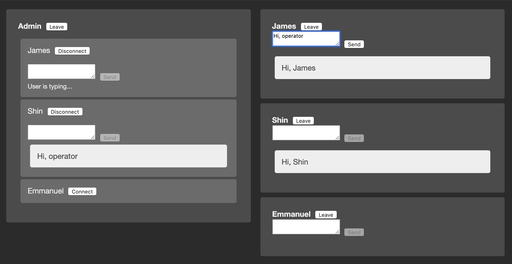

## support-chat
A simple chat demo using [pusher](https://pusher.com/), Vue and Go.

<p align="center">
    
</p>

### Features
- Online user list (presence channels)
- 1:N admin-to-user chat (private channels)
- Real-time `user is typing` message (client events)

### Run

① Execute: 
```
GO111MODULE=on SUPPORT_PUSHER_KEY="..." SUPPORT_PUSHER_SECRET="..." go run main.go
```

② Then open http://localhost:8080
